<p align="center">
  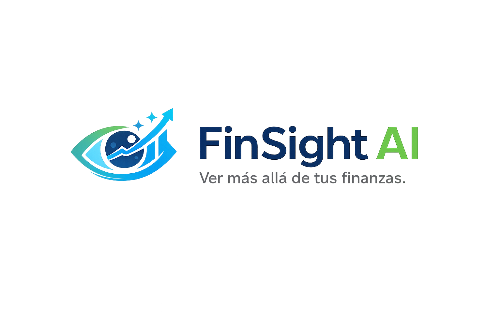
</p>

<h1 align="center">FinSightAI</h1>
<p align="center"><em>Ver más allá de tus finanzas</em></p>

<p align="center">
  
  
  
  
  
  
  
  
</p>

<p align="center">
  Proyecto desarrollado para el Hackathon <strong>Oracle Next Education (ONE)</strong> y <strong>No Country</strong><br>
  Equipo <strong>TwentyNine Devs</strong> · G9 LATAM Team 29
</p>

---

## 📖 Descripción

<table>
<tr>
<td width="78%" valign="middle">

**FinSightAI** es una plataforma web que ayuda a los usuarios a comprender su situación financiera mediante técnicas de Ciencia de Datos, Machine Learning e Inteligencia Artificial.

A partir de los ingresos, deudas, hábitos de ahorro y transacciones financieras, la plataforma analiza el comportamiento económico del usuario, clasifica automáticamente sus gastos, identifica patrones de consumo y genera recomendaciones personalizadas para favorecer una mejor toma de decisiones — con **Finsi**, un asistente conversacional, como guía en todo el proceso.

> 💬 *"¡Hola! Soy Finsi — te acompaño en cada análisis, cada meta y cada duda financiera."*

</td>
<td width="22%" align="center" valign="middle">

</td>
</tr>
</table>

## 🎯 Problema y solución

Muchas personas registran sus ingresos y gastos, pero les resulta difícil transformar esos datos en información útil para comprender su situación financiera y mejorar su planificación económica.

**FinSightAI** convierte esos datos en información clara, explicable y accionable mediante modelos de Machine Learning, un Financial Score propio y un agente de IA capaz de responder preguntas concretas sobre las finanzas del usuario.

---

## 🚀 Funcionalidades

<table>
<tr>
<td width="82%" valign="top">

**💰 Gestión financiera**

- Importación de movimientos vía CSV con clasificación automática de categorías.
- Historial de transacciones con resúmenes y filtros por tipo/categoría.
- Análisis del perfil financiero y Financial Score personalizado.
- Evaluación del nivel de riesgo con explicación automática, fortalezas y oportunidades de mejora.
- Recomendaciones financieras personalizadas y priorizadas.
- Metas de ahorro: creación, aportes, liberación de fondos y cancelación.
- Recordatorios y eventos financieros en calendario (exportables a `.ics`).
- Exportación de reportes en CSV, XLSX y PDF.

</td>
<td width="18%" align="center" valign="top">
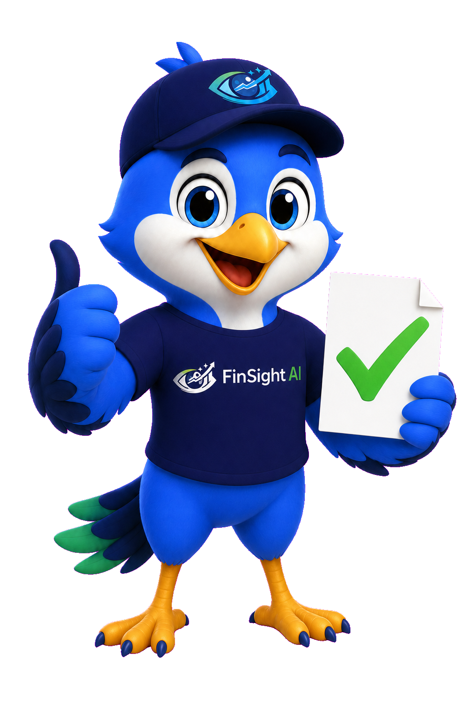
</td>
</tr>
</table>

<table>
<tr>
<td width="18%" align="center" valign="top">
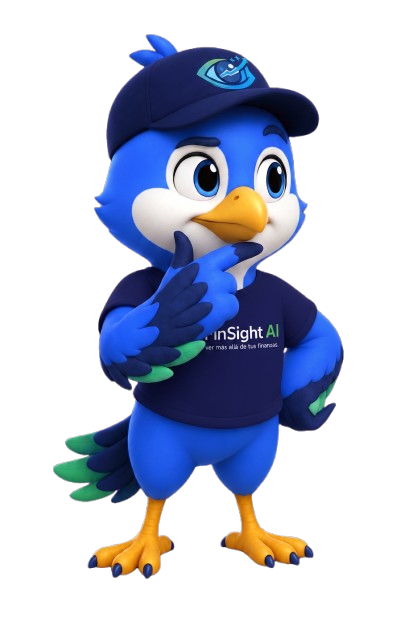
</td>
<td width="82%" valign="top">

**🤖 Inteligencia Artificial — Finsi**

- Asistente conversacional financiero con memoria de contexto (Groq / Gemini).
- Motor determinístico + LLM híbrido para respuestas explicables y consistentes.
- Respuestas en streaming para una conversación más fluida.
- Chat de soporte técnico con base de conocimiento propia (RAG).
- Clasificación de gastos y de perfil financiero vía modelos de ML entrenados en el pipeline de Data Science.
- Políticas de seguridad que bloquean el acceso a datos de otros usuarios e intentos de prompt injection.

</td>
</tr>
</table>

<table>
<tr>
<td width="80%" valign="top">

**🎮 Engagement**

- Sistema de logros y gamificación, con historial de desbloqueos.
- Notificaciones push y recordatorios por correo.
- Dashboard interactivo con historial de análisis.
- Finsi acompaña la experiencia con mensajes contextuales en cada pantalla.

</td>
<td width="20%" align="center" valign="top">

</td>
</tr>
</table>

<table>
<tr>
<td width="18%" align="center" valign="top">

</td>
<td width="82%" valign="top">

**🔐 Cuenta y plataforma**

- Autenticación y sesiones vía Supabase (JWT), recuperación y cambio de contraseña.
- Roles de Usuario / Administrador, con cuentas demo para evaluación.
- Verificación de propiedad de datos en cada endpoint sensible (OwnershipInterceptor).
- Cierre de sesión automático por inactividad, además del manual.
- Baja de cuenta con preservación de historial (soft delete).
- API REST documentada (OpenAPI/Swagger) para integraciones externas.

</td>
</tr>
</table>

---

## 🛠 Stack tecnológico

| Capa | Tecnologías |
|---|---|
| **Frontend** | React 19, TypeScript, Vite, TailwindCSS 4, React Router, Supabase JS, ApexCharts, jsPDF / ExcelJS |
| **Backend** | Java 21, Spring Boot 3.4, Spring Data JPA, Flyway, OAuth2 Resource Server, SpringDoc OpenAPI (Swagger) |
| **AI-Service** | Python, FastAPI, scikit-learn, Pandas, NumPy, FAISS (RAG), Joblib, Groq y Gemini (LLM) |
| **Datos y autenticación** | Supabase (PostgreSQL + Auth) |
| **Cloud y despliegue** | Vercel (frontend + Edge Functions), Render (Backend y AI-Service vía Docker) |
| **DevOps** | Git, GitHub, GitHub Actions, Docker |

---

## 🏗 Arquitectura

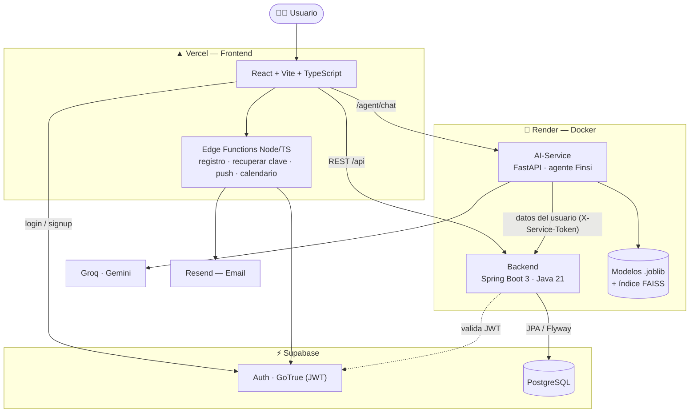
```mermaid
flowchart TB
    Browser(["🧑‍💻 Usuario"])

    subgraph Vercel["▲ Vercel — Frontend"]
        SPA["React + Vite + TypeScript"]
        Edge["Edge Functions Node/TS<br/>registro · recuperar clave · push · calendario"]
    end

    subgraph Render["🔺 Render — Docker"]
        Backend["Backend<br/>Spring Boot 3 · Java 21"]
        AIService["AI-Service<br/>FastAPI · agente Finsi"]
        Models[("Modelos .joblib<br/>+ índice FAISS")]
    end

    subgraph Supabase["⚡ Supabase"]
        Auth["Auth · GoTrue (JWT)"]
        DB[("PostgreSQL")]
    end

    LLM["Groq · Gemini"]
    Resend["Resend — Email"]

    Browser --> SPA
    SPA -- "REST /api" --> Backend
    SPA -- "/agent/chat" --> AIService
    SPA -- "login / signup" --> Auth
    SPA --> Edge
    Edge --> Auth
    Edge --> Resend

    Backend -- "JPA / Flyway" --> DB
    Backend -. "valida JWT" .-> Auth
    AIService -- "datos del usuario (X-Service-Token)" --> Backend
    AIService --> Models
    AIService --> LLM
```


---

## 📊 Flujo de funcionamiento

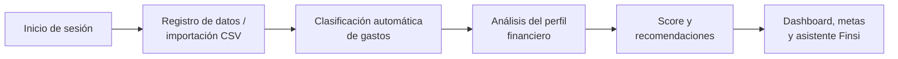
```mermaid
flowchart LR
    A[Inicio de sesión] --> B[Registro de datos /<br/>importación CSV]
    B --> C[Clasificación automática<br/>de gastos]
    C --> D[Análisis del perfil<br/>financiero]
    D --> E[Score y<br/>recomendaciones]
    E --> F[Dashboard, metas<br/>y asistente Finsi]
```

---

## 📂 Estructura del proyecto

```text
Backend/Backend/     # API REST — Spring Boot (Java 21)
AI-Service/          # Microservicio de IA — FastAPI, agente Finsi, modelos ML
Data-Science/        # Notebook, datasets y pipeline de Machine Learning
frontend/            # SPA — React + Vite + Edge Functions (Vercel)
docs/                # Casos de uso, documentación técnica y auditorías
scripts/database/    # Scripts de carga de datos a Supabase
```

---

## ⚙️ Puesta en marcha local

<details>
<summary><strong>Backend</strong> — Spring Boot</summary>

```bash
cd Backend/Backend
mvn spring-boot:run
```
</details>

<details>
<summary><strong>AI-Service</strong> — FastAPI</summary>

```bash
cd AI-Service
python -m venv .venv
.venv\Scripts\activate      # Windows
pip install -r requirements.txt
uvicorn app.main:app --reload --port 8000
```
</details>

<details>
<summary><strong>Frontend</strong> — React + Vite</summary>

```bash
cd frontend
npm install
npm run dev
```
</details>

> Variables de entorno y guía completa de despliegue en producción (Vercel + Render + Supabase): ver [`DEPLOY.md`](DEPLOY.md).

---

## 📚 Documentación

| Documento | Contenido |
|---|---|
| [`docs/casos_uso.md`](docs/casos_uso.md) | 18 casos de uso (patrón Boundary–Control–Entity) con diagramas de secuencia |
| [`docs/ai-service/`](docs/ai-service) | Documentación técnica del microservicio de IA |
| [`docs/data-science/`](docs/data-science) | Documentación del pipeline de Ciencia de Datos |
| [`Data-Science/README.md`](Data-Science/README.md) | Notebook, modelos e integración con el AI-Service |
| [`DEPLOY.md`](DEPLOY.md) | Infraestructura y guía de despliegue |
| [`owasp-audit-report.md`](owasp-audit-report.md) | Informe interno de revisión de seguridad (OWASP) |
| API Backend | Swagger / OpenAPI en `/swagger-ui.html` al levantar el servicio |

> 🚧 La documentación técnica del **Frontend** está en preparación — próxima actualización.

---

## 🤖 Ciencia de Datos

El AI-Service se apoya en dos modelos propios, entrenados sobre datos sintéticos y serializados con Joblib al final de un pipeline de 28 pasos: generación de datos → EDA → limpieza → ingeniería de atributos → entrenamiento → validación cruzada → calibración → interpretabilidad → exportación.

| Modelo | Técnica | Accuracy | F1 macro |
|---|---|---|---|
| Clasificador de gastos (16 categorías) | TF-IDF + `SGDClassifier` calibrado | 99.7 % *(CV agrupada por descripción)* | 97.7 % |
| Clasificador de perfil financiero (3 clases) | Regresión logística | 89.6 % *(CV estratificada, 5 folds)* | 90.1 % |

- **Validación agrupada por descripción** (`StratifiedGroupKFold`): las transacciones se agrupan por texto para que la misma descripción nunca aparezca en train y test a la vez, evitando fuga de datos y una accuracy inflada artificialmente.
- **Calibración de probabilidades** (`CalibratedClassifierCV`, método sigmoide) antes de exponer el modelo en producción, para que los scores de confianza sean interpretables.
- **Gate de calidad automático** que el clasificador de gastos debe aprobar antes de serializarse: accuracy ≥ 0.90, F1 macro ≥ 0.88, brecha train/test ≤ 0.05 y F1 mínimo por clase ≥ 0.80.
- **Artefactos exportados**: `clasificador_gastos.joblib`, `clasificador_perfil.joblib`, `metadata_modelos.json`, `metricas_modelos.csv`, `ejemplos_respuesta_backend.json` — el mismo pipeline serializado se carga tal cual en el AI-Service, sin reescribir el preprocesamiento.

> ⚠️ Entrenado con datos **sintéticos**. El Financial Score y el perfil no constituyen una calificación crediticia ni un diagnóstico profesional; antes de un uso productivo real haría falta reentrenar con datos reales, sumar monitoreo de deriva y revisión por especialistas del dominio — ver limitaciones completas en [`Data-Science/README.md`](Data-Science/README.md).

Notebook completo, ejecutable en Google Colab: [`Data-Science/FinSightAI_DataScience_1.0.ipynb`](Data-Science/FinSightAI_DataScience_1.0.ipynb) ·
[](https://colab.research.google.com/github/No-Country-simulation/G9-FinanceAI-Team29/blob/main/Data-Science/FinSightAI_DataScience_1.0.ipynb)

---

## 📅 Estado del proyecto

<table>
<tr>
<td width="78%" valign="middle">

- ✅ Diseño de arquitectura y pipeline de datos
- ✅ Entrenamiento y serialización de modelos de ML
- ✅ Microservicio de IA (FastAPI) + agente conversacional Finsi
- ✅ Backend (Spring Boot) integrado con Supabase y el AI-Service
- ✅ Frontend (React) con dashboard, metas, CSV y exportación de reportes
- ✅ Gamificación y notificaciones (push + email)
- ✅ Despliegue en Vercel (frontend) y Render (Backend / AI-Service)
- ✅ Auditoría de seguridad inicial (OWASP)
- ✅ Presentación final del proyecto

</td>
<td width="22%" align="center" valign="middle">

</td>
</tr>
</table>

---

## 👥 Equipo

<p align="center">
  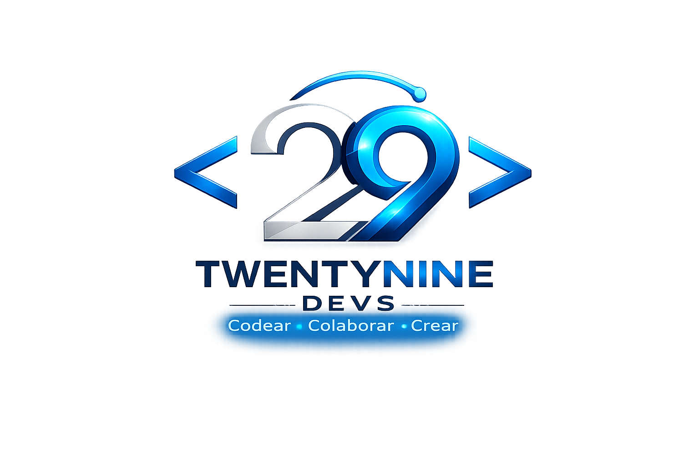
</p>

<h3 align="center">G9 LATAM Team 29</h3>

<p align="center">
  Equipo multidisciplinario participante del Hackathon <strong>Oracle Next Education (ONE)</strong> y <strong>No Country</strong>.<br>
  Desarrollo de Frontend, Backend, Ciencia de Datos, Machine Learning, UX/UI y Gestión Ágil.
</p>

<table width="100%">
  <tr>
    <td align="center" valign="top" width="20%">
      <br>
      <b>Guillermo<br>Illanes</b><br>
      <br>
      <sub>Team Lead ·<br>Full Stack Developer</sub><br>
       <sub>Argentina</sub><br><br>
      <a href="https://www.linkedin.com/in/guillermo-illanes-172aaa229/"></a>
      <a href="https://github.com/guille2506"></a>
    </td>
    <td align="center" valign="top" width="20%">
      <br>
      <b>Alberto Edgardo<br>Villalba</b><br>
      <sub>&nbsp;</sub><br>
      <sub>Full Stack Developer ·<br>AI Developer · Data Scientist</sub><br>
       <sub>Argentina</sub><br><br>
      <a href="https://www.linkedin.com/in/edgardo-villalba/"></a>
      <a href="https://github.com/Linth84"></a>
    </td>
    <td align="center" valign="top" width="20%">
      <br>
      <b>Felipe Pereira<br>Alarcón</b><br>
      <sub>&nbsp;</sub><br>
      <sub>Full Stack Developer ·<br>Frontend · Data Scientist</sub><br>
       <sub>Chile</sub><br><br>
      <a href="https://www.linkedin.com/in/felipe-pereira-alarcon/"></a>
      <a href="https://github.com/fpereira22"></a>
    </td>
    <td align="center" valign="top" width="20%">
      <br>
      <b>Karen<br>Domínguez</b><br>
      <sub>&nbsp;</sub><br>
      <sub>Data Analyst ·<br>QA Tester</sub><br>
       <sub>Colombia</sub><br><br>
      <a href="https://www.linkedin.com/in/karen-domínguez-0897bb295"></a>
      <a href="https://github.com/Karen314"></a>
    </td>
    <td align="center" valign="top" width="20%">
      <br>
      <b>Raúl Enrique<br>Vidaurre Vallejos</b><br>
      <sub>&nbsp;</sub><br>
      <sub>Data Analyst · Backend ·<br>QA Tester</sub><br>
       <sub>Perú</sub><br><br>
      <a href="https://github.com/Raul-V2"></a>
    </td>
  </tr>
</table>

<p align="center">
  <br>
  <sub><em>Finsi — mascota (y sexto miembro honorario) del equipo 🐦</em></sub>
</p>

---

## 📸 Capturas de pantalla

### 📊 Dashboard Financiero
| Modo Claro ☀️ | Modo Oscuro 🌙 |
|---|---|
| 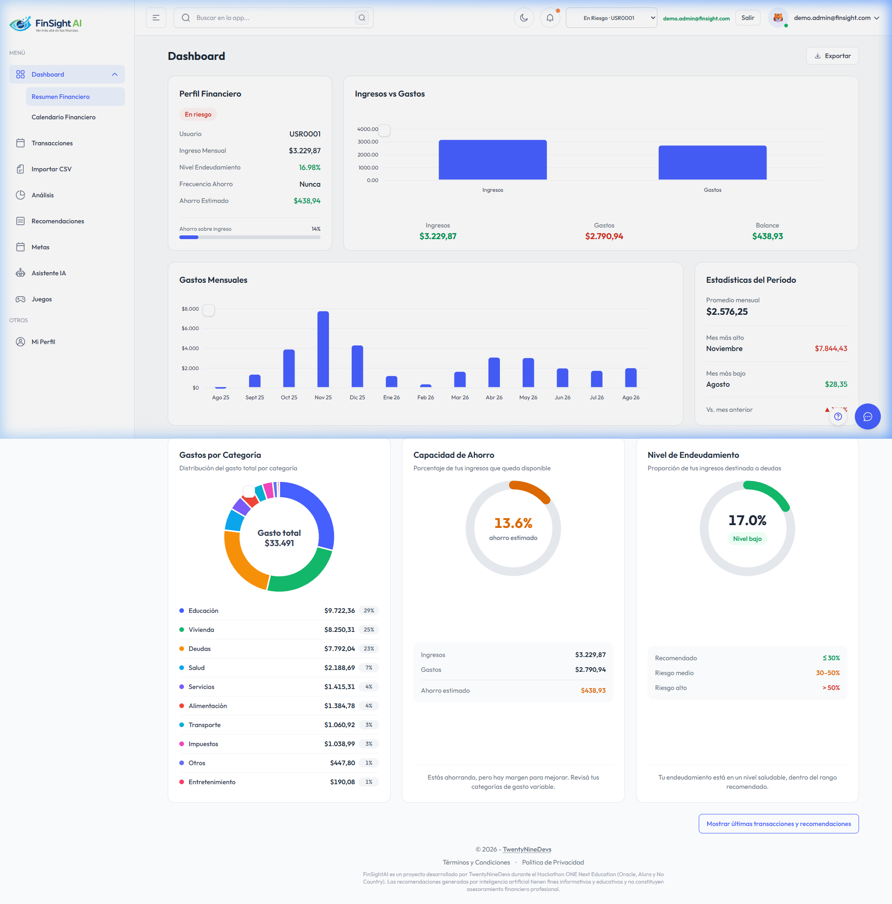 | 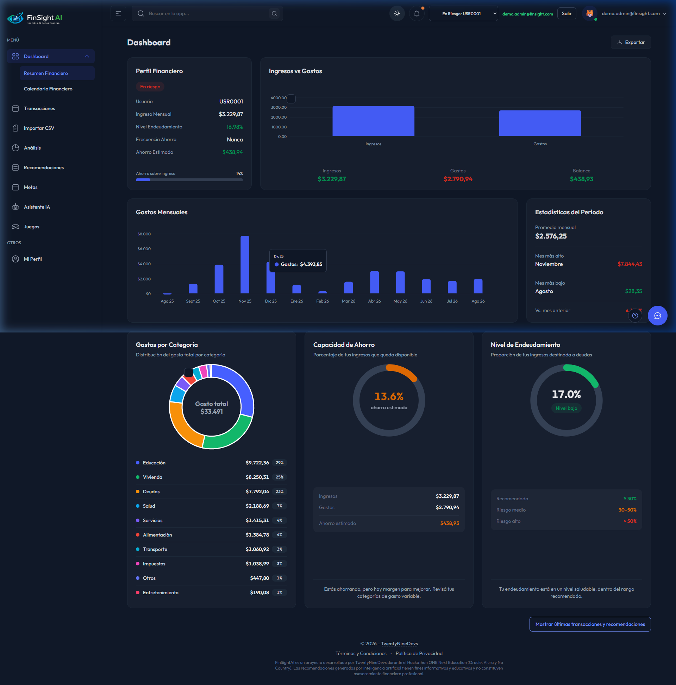 |

---

### 📈 Análisis Financiero & Predicciones de ML
| Modo Claro ☀️ | Modo Oscuro 🌙 |
|---|---|
| 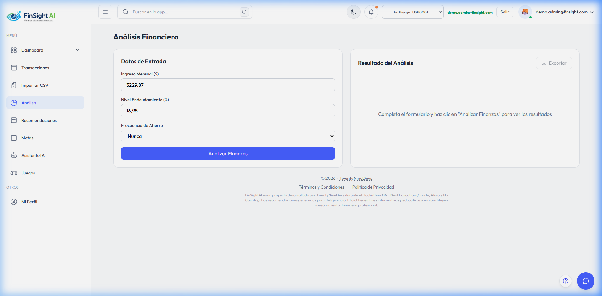 | 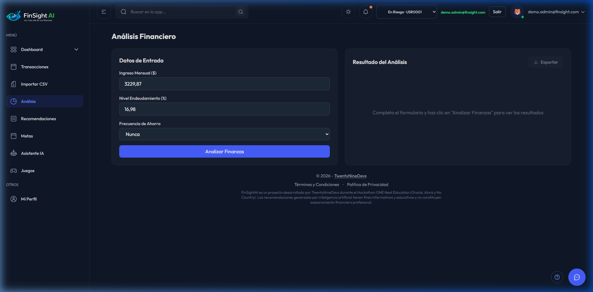 |

---

### 🤖 Asistente IA (Finsi) & Recomendaciones Personalizadas
| Asistente IA (Modo Claro) ☀️ | Asistente IA (Modo Oscuro) 🌙 |
|---|---|
| 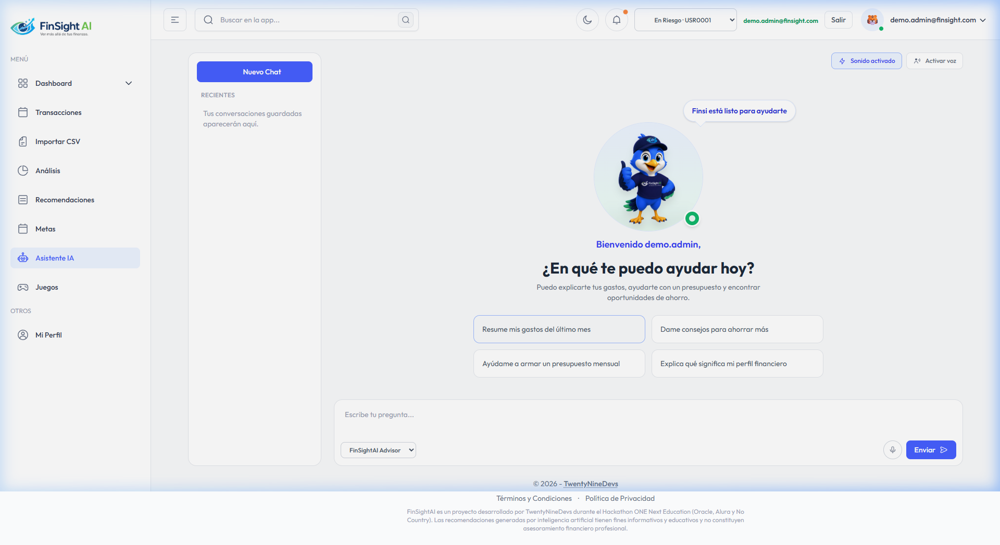 | 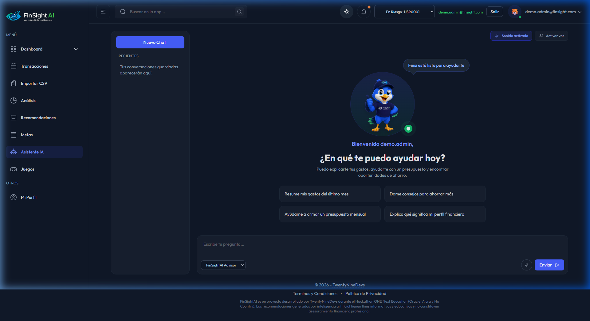 |

| Recomendaciones (Modo Claro) ☀️ | Recomendaciones (Modo Oscuro) 🌙 |
|---|---|
| 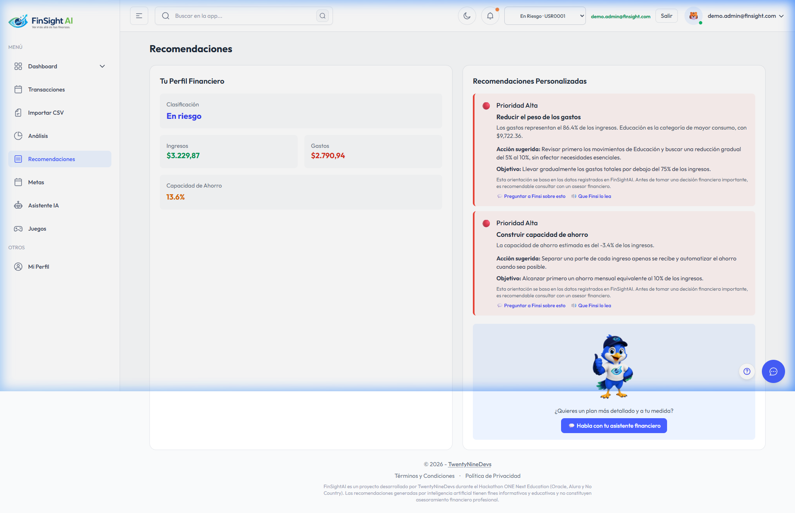 | 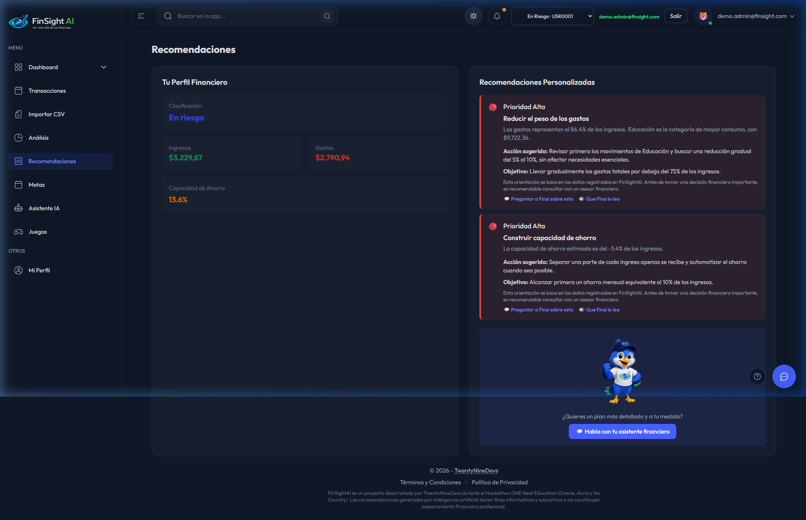 |

---

### 💳 Transacciones & Metas Financieras
| Gestor de Transacciones | Metas de Ahorro |
|---|---|
| 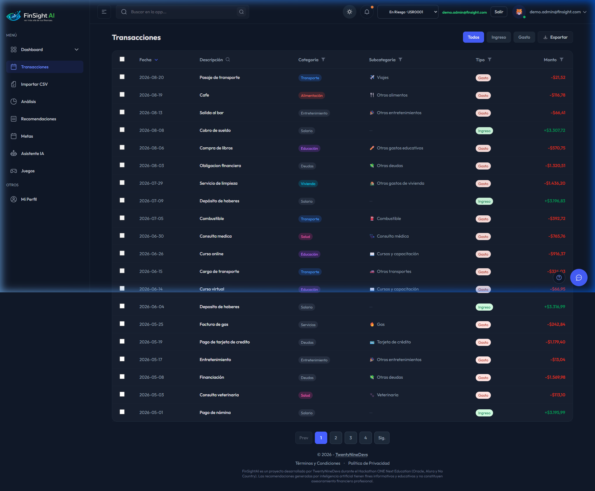 | 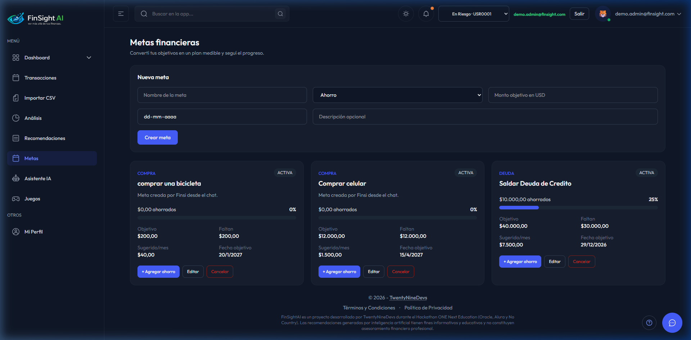 |

---

### 🎮 Gamificación, Modo Matrix y Herramientas
| Modo Matrix (Easter Egg 🕶️) | Juegos y Logros |
|---|---|
| 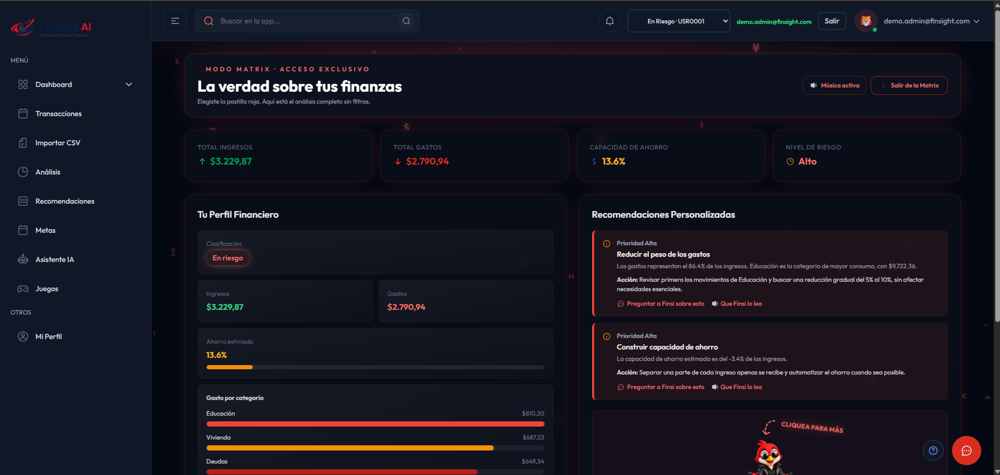 | 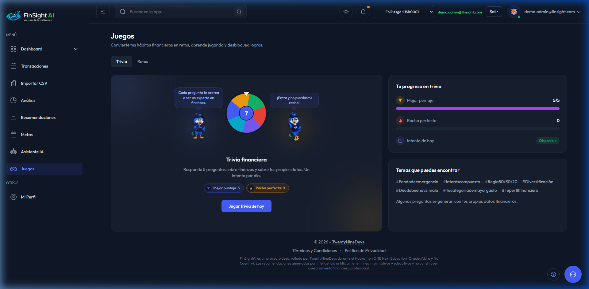 |

| Calendario Financiero | Centro de Soporte |
|---|---|
| 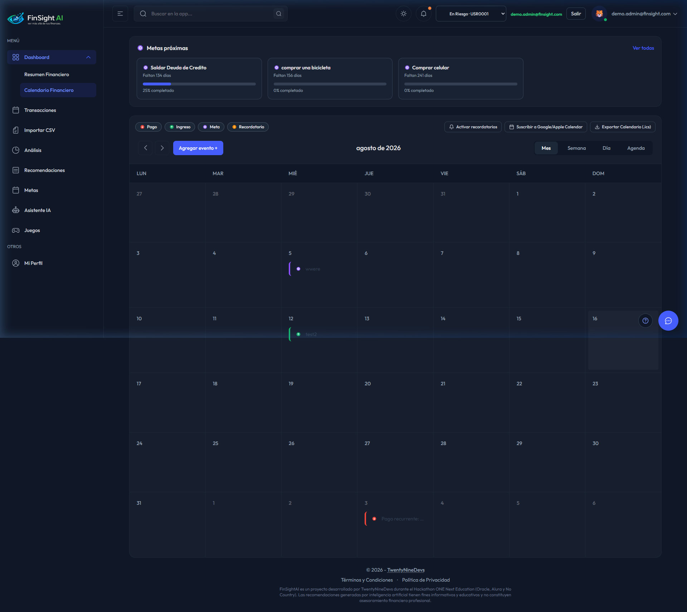 | 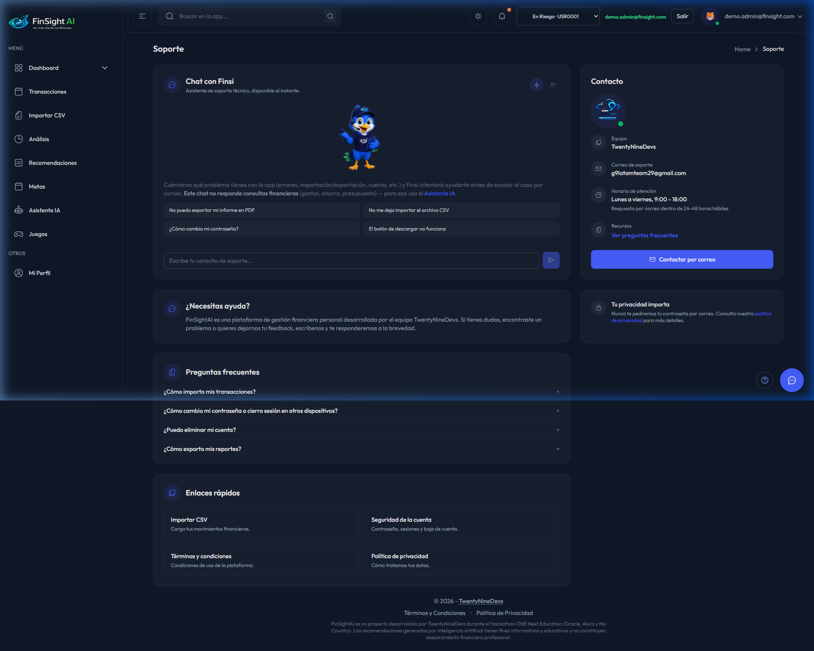 |

---

### 🔌 Documentación de APIs (Backend Spring Boot & AI Service FastAPI)
| Swagger REST API (Java Spring Boot) | AI Service API Docs (Python FastAPI) |
|---|---|
| 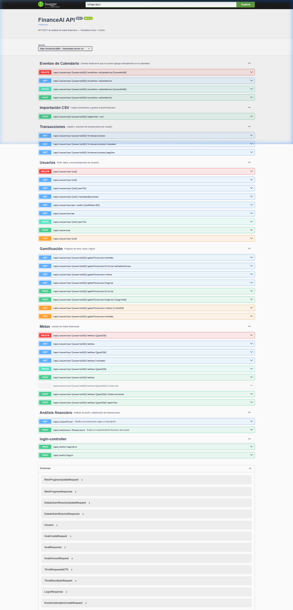 | 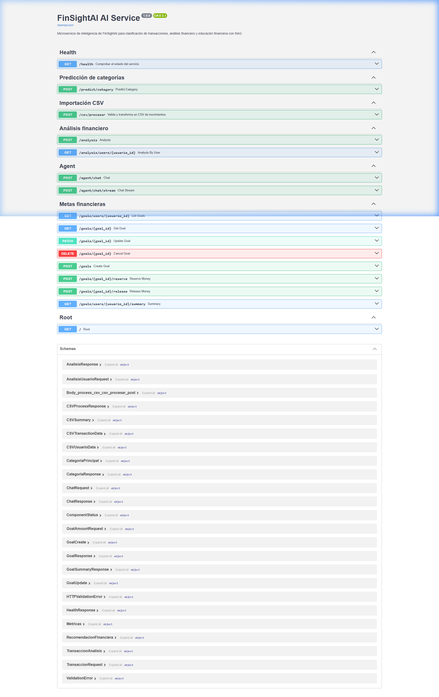 |

---

## 📄 Licencia

Proyecto desarrollado con fines educativos para el **Hackathon Oracle Next Education (ONE)**, organizado por **Alura Latam**, **Oracle** y **No Country**.

Su propósito es demostrar la integración de tecnologías de desarrollo web, Ciencia de Datos, Machine Learning e Inteligencia Artificial para resolver un problema real relacionado con la educación financiera.
